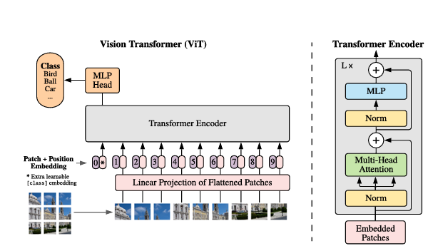

## Implementation of ViT (vision transfomer) from scratch with pyTorch
  
An Image is worth 16x16 words: Transformers for image recognition at scale
https://arxiv.org/abs/2010.11929  

## Parameters

- `patch_size`: int.  
Number of patches. Make sure `image_size` be divisible by `patch_size`.  
The number of patches is: ` n = (image_height / patch_size) * (image_width / patch_size) `.
- `dim`: int.  
Embedding dimension
- `depth`: int.  
Number of attention blocks 
- `num_heads`: int.  
Number of heads in Multi-head Attention layer. 
- `mlp_dim`: int.  
Dimension of the MLP (FeedForward) layer. 
- `channels`: int, default `3`.  
Number of image's channels. 
- `dropout`: float between `[0, 1]`, default `0.`.  
Dropout rate. 

